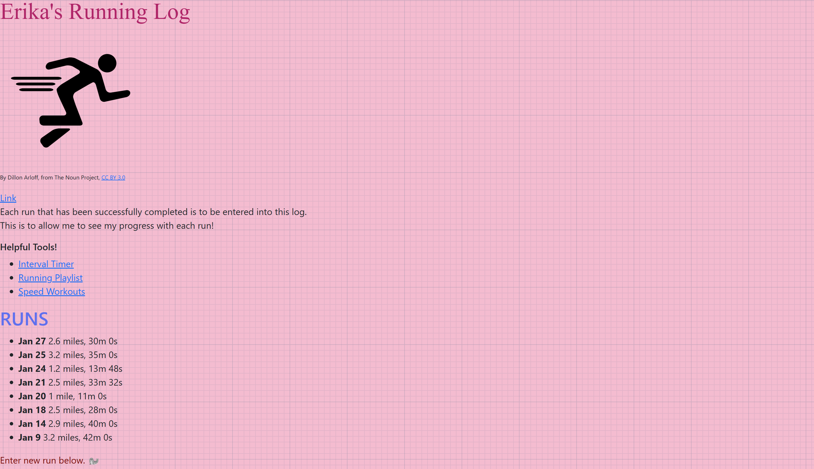
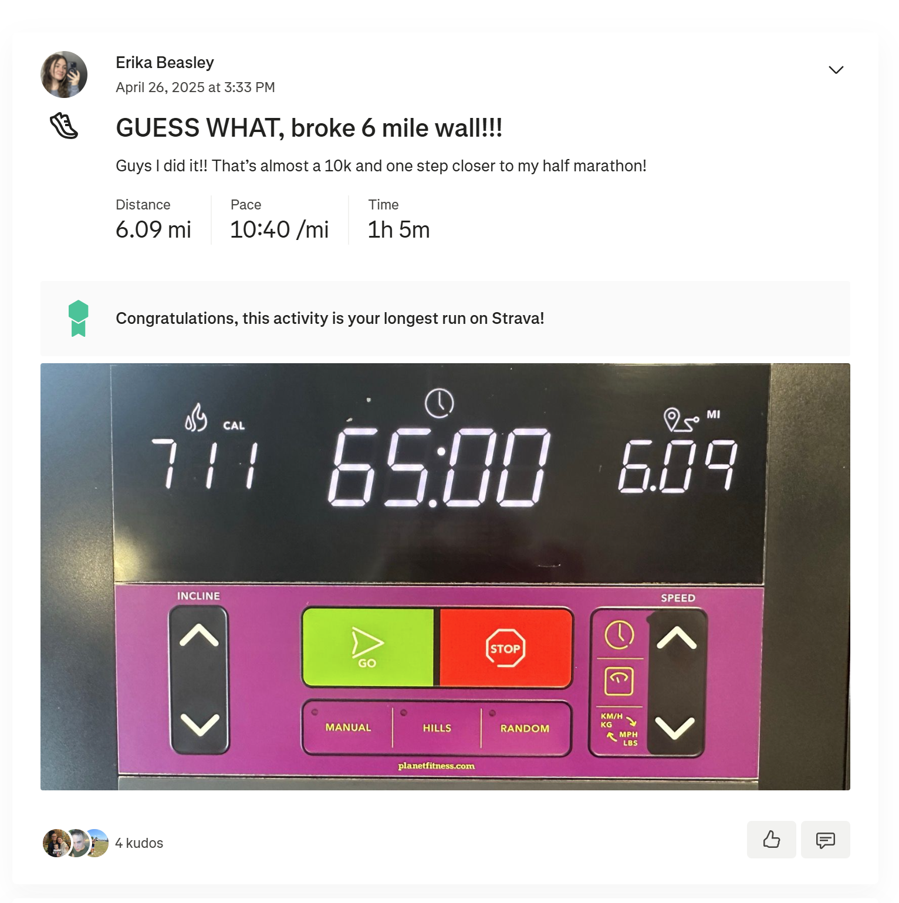

# Running Log App

### Authorship and Attributions
Created by Erika Beasley for CIS-366.
- https://getbootstrap.com/docs/5.3/getting-started/introduction/
- https://www.w3schools.com/html/
- https://github.com/barrycumbie/jubilant-garbanzo-easy-read
- https://colorhunt.co/palette/56021f7d1c4ad17d98f4cce9
- https://forum.bootstrapstudio.io/t/changing-the-navbar-color/10513/3

## User Story
As a runner, I wanted to be able to log my runs in order to track my progress over the course of months as I train for a half marathon!!

## Narrative
This running app is a revamped version of my original running log that I created for my first project in CIS-366. It's really come full circle.

Here is a quick look at my original web app ⬇️⬇️⬇️

Now look at this code from to OG app! 🙃
```
  <h2 id='runHeader'>RUNS</h2>
  <ul>
    <li><strong>Jan 27</strong> 2.6 miles, 30m 0s</li>
    <li><strong>Jan 25</strong> 3.2 miles, 35m 0s</li>
    <li><strong>Jan 24</strong> 1.2 miles, 13m 48s</li>
    <li><strong>Jan 21</strong> 2.5 miles, 33m 32s</li>
    <li><strong>Jan 20</strong> 1 mile, 11m 0s</li>
    <li><strong>Jan 18</strong> 2.5 miles, 28m 0s</li>
    <li><strong>Jan 14</strong> 2.9 miles, 40m 0s</li>
    <li><strong>Jan 9</strong> 3.2 miles, 42m 0s</li>
  </ul> 
  ```
I drew a lot of inspiration from my favorite app, Strava. Take a look! 
